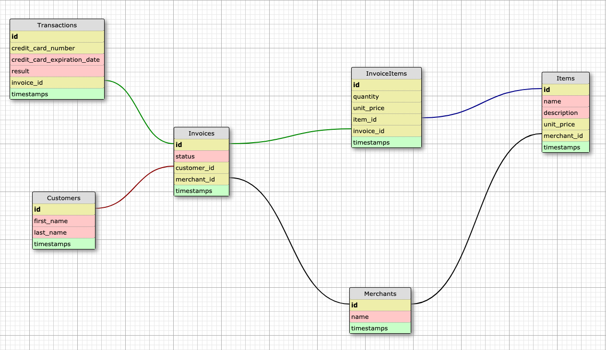

# README

Rails Engine is a project that is meant to provide practice for generating APIs.  The project uses several CSV files of sales data.  The APIs to be generated are based on this data.  The are several segments of API types that were created.  One is record endpoints, which show all of the associated records.  Another is the individual record endpoints.  There are finder endpoints, where a record (or all records) can be found based on the value of any attribute for that record.

Business intelligence endpoints are also given.  These endpoints are used to display calculations on the data given in the CSV files.  Relationship endpoints are given as well, which show how the resources are interconnected.  A random endpoint is also shown, which picks a resource record at random.

* Tech stack

Ruby version 2.4.1 was used for this project.  Ruby on Rails version 5.2.3 was used. For the database, Postgresql version 11.1 was used.

* Set up

Clone this repository to your computer.  Once it has been cloned, run `bundle`.

* Database creation

After bundling, run `rake db:{drop,create,migrate}`.

* Database initialization

Initializing the database requires running a rake task to import the CSV data into the database.  The raw CSV files are located in the /lib/data folder.

To implement the rake task, run `rake import:sales_engine`.

* Database schema

The database consists of 6 tables.  The schema is shown below.

* How to run the test suite

The test suite is run by issuing the command `rspec` at the command line.

* How to contribute

If you would desire to contribute to the project, fork the project from the master branch.  You can then make the changes you think are appropriate and submit a pull request.  Please provide a detailed explanation in the pull request of what the problem or fix is.  

* Contact

The author of project, Earl Stephens, can be reached at: 34906415+earl-stephens@users.noreply.github.com
